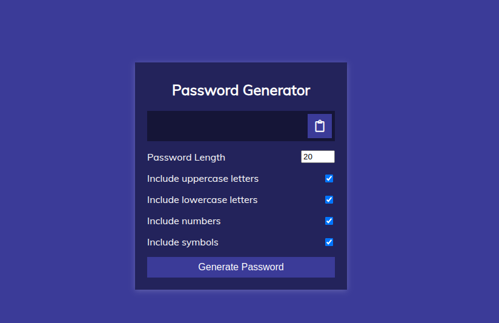

# Password Generator

A simple **Password Generator** built using **HTML, CSS, and JavaScript**.

## Demo

> Add an actual screenshot of the project in your repository and update the file name accordingly.

## Features
- Generates a secure password based on user preferences.
- Allows customization of password length (4-20 characters).
- Option to include uppercase letters, lowercase letters, numbers, and symbols.
- Click-to-copy functionality for easy password copying.
- Responsive and clean UI design.

## Technologies Used
- **HTML** for structuring the webpage.
- **CSS** for styling and layout.
- **JavaScript** for password generation logic and interactivity.

## Installation
1. Clone the repository:
   ```sh
   git clone https://github.com/bhramarambha8660/password-generator.git
   ```
2. Navigate to the project directory:
   ```sh
   cd password-generator
   ```
3. Open `index.html` in your browser.

## Usage
- Adjust settings (length, character types) as needed.
- Click **Generate Password** to create a new password.
- Click the **Clipboard** button to copy the password.

## File Structure
```
|-- password-generator/
    |-- index.html    # Main HTML file
    |-- style.css     # Stylesheet for UI design
    |-- script.js     # JavaScript for password generation
    |-- password.png # Add your screenshot here
    |-- README.md     # This file
```

## License
This project is open-source and available under the **MIT License**.

---

Enjoy generating strong passwords! 🔐

